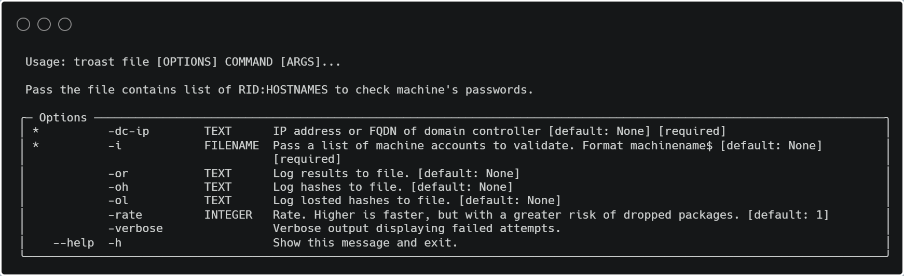

# Pre2k + timeroast = troast

Troast is Pre2k without password spray.

## Installation

```
git clone https://github.com/xfusion13/troast.git /opt/troast
```
```
pip install /opt/troast
```
or
```
pipx install -f "git+https://github.com/xfusion13/pre2k.git";
```

## Usage


## Range


## File


## Auth


## Gen-Dict


## Credits

https://github.com/SecuraBV/Timeroast

https://github.com/garrettfoster13/pre2k
